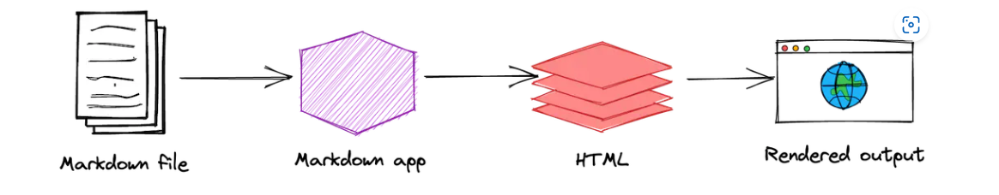

# Git OR Github

- Git and Github are two different things.
- Git is the version control system.
- GitHub is a service for hosting Git repos that helps people collaborate on writing software.

# Similar Service

- GitLab
- BitBucket

# What is a repository?

- A repository is usually used to organize a single project. Repositories can contain folders and files, images, videos, spreadsheets, and data sets -- anything your project needs. Often, repositories include a README file, a file with information about your project. README files are written in the plain text Markdown language.

# What are branches?

- By default, your repository has one branch named main that is considered to be the definitive branch. You can create additional branches off of main in your repository. You can use branches to have different versions of a project at one time. This is helpful when you want to add new features to a project without changing the main source of code.

- Have you ever saved different versions of a file? Something like:

  - story.txt
  - story-edit.txt
  - story-edit-reviewed.txt

Making and commiting changes

- Two ways
- Using git bash
  - About this in command's section.
- Using github
  - Give a demo.

# What is a Commit?

- A commit is when you tell Git to save these staged changes.

# What is a Pull Request?

- When you open a pull request, you're proposing your changes and requesting that someone review and pull in your contribution and merge them into their branch.

- Pull requests show diffs, or differences, of the content from both branches. The changes, additions, and subtractions are shown in different colors.

## Mention username in pull request

    `@username`

# How to merge a pull request?

- At the bottom of the pull request, click Merge pull request to merge the changes into main.

# Forks

- Github forks local copy of a project folder/repository.
- You can make a relevant chanages ask the owner to review changes

# About Markdown

- Markdown is a lightweight markup language that you can use to add formatting elements to plaintext text documents.

## Why use markdown

- Simplicity, Readability, Speed, Widely Supported

## How does markdown work



## Basic Syntax

- Heading

  - # H1
  - ## H2
  - ### H3

- Bold Text

  - **bold Text**

- Italic Text

  - _Italic Text_

- Blockquote

  > Blockquote

- Ordered List

  1. Item 1
  2. Item 2

- Unordered List

  - Item 1
  - Item 2

- Code

  `console.info('Block of code!')`

- Horizontal Rule

  ***

- Link
  [title](https://www.example.com)

- Image
  

## Extended Syntax/ Advanced Syntax

- Table

<!-- | ------ | ---------- | -->

| Sr. No | First Name |
| :----- | :--------: |
| 1      | John Cena  |
| 2      |  CM Punk   |

- Emoji

  That is so funny! :joy:

- Fenced Code Blocks

```
{
  "firstName": "John",
  "lastName": "Smith",
  "age": 25
}
```

- Syntax Highlighting
```json
{
  "firstName": "John",
  "lastName": "Smith",
  "age": 25
}
```
- Heading IDs
    ### My Great Heading {#heading-id}

- Definition Lists

    First Term
     : This is the definition of the first term.

# Install Git

- Windows: Download

# Three section of a Git Project

- Git directory
  - Git stores everything it needs to accurately track the project.
- Working directory
  - User makes local changes to a project.
- Staging area
  - Information about what will go into your next commit.

Command's

Check git version

    `git -v`
    `git --version`

Get git help

    `git -h`
    `git --help`

To Know the username

    git config user.name

To Know the email

    git config user.email
